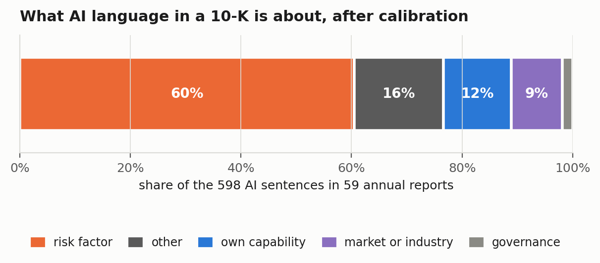
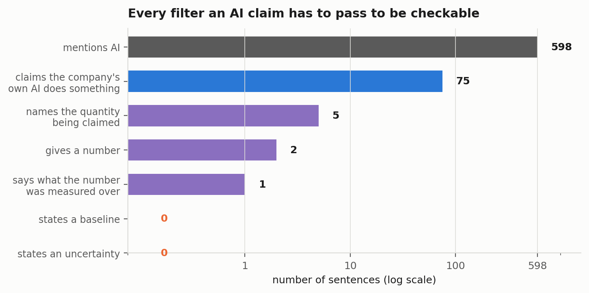
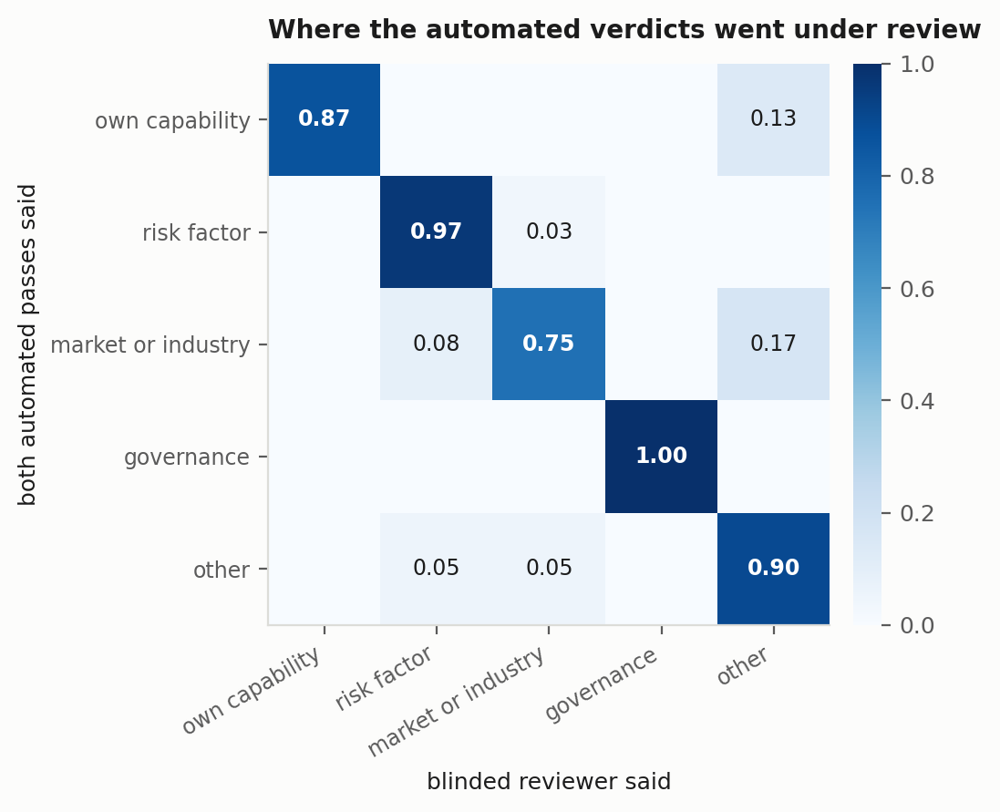

# One checkable claim

An audit of what public companies actually say about their own artificial intelligence in
their annual reports, and whether anyone outside the company could verify it.

**Paper:** [`paper/ai-claims-audit.pdf`](paper/ai-claims-audit.pdf) ·
**Preregistration:** [`docs/PREREGISTRATION.md`](docs/PREREGISTRATION.md)

---

## The result

Across 59 ordinary 10-K filings from calendar 2025, 598 sentences mention AI.

| | count | share |
|---|---:|---:|
| AI sentences in the corpus | 598 | — |
| risk-factor language (calibrated) | 362 | 60.5% |
| claims about the registrant's own AI capability | 75 | 12.2% |
| of those, name the quantity being claimed | 5 | 6.7% of claims |
| of those, attach a number to it | 2 | 2.7% of claims |
| of those, say what the number was measured over | 1 | 1.3% of claims |
| of those, state a baseline | 0 | 0% |
| of those, state an uncertainty | 0 | 0% |

Seventy of the 75 capability claims score zero on all five verifiability dimensions.
**One sentence out of 598, in one annual report out of 59, clears the minimum bar at which
an outside reader could attempt verification.**

The SEC has brought AI-washing cases against companies whose claims were specific enough to
be disproved. This study measures how rare that specificity is. The modal AI capability
claim in an annual report is not false; it is unfalsifiable, and enforcement built on
falsity has almost nothing to act on.





## How it was done

1. **Frame.** Every 10-K filed in calendar 2025 whose full text matches the exact phrase
   *artificial intelligence* in EDGAR full-text search: 3,324 filings from 3,173 distinct
   registrants, enumerated completely rather than sampled.
2. **Sample.** Fifteen filings per stratum from four SIC-derived strata — technology,
   healthcare, finance and real estate, everything else — under seed 20260926. Sixty
   filings, one per registrant.
3. **Extraction.** A deterministic sentence splitter and a fixed AI term list, both frozen
   before any filing was downloaded. 623 sentences, median 7 per filing.
4. **Blinding.** Raters see the sentence and nothing else, in a seeded shuffle that mixes
   filings, with the registrant's name and ticker redacted. Each sentence is rated twice by
   independent passes that cannot see each other.
5. **Rubric.** One of five classes per sentence; on capability claims, five binary
   verifiability judgements. Written into the preregistration before any sentence was read.
6. **Calibration.** Three components, described below.
7. **Statistics.** Wilson intervals on proportions; all filing-level uncertainty from a
   percentile bootstrap that resamples **filings, not sentences**, because sentences inside
   one filing share an author and a legal reviewer.

## What the calibration found

This study was built on the assumption that its own automated passes would be biased,
because that is what happened in
[the companion audit of the KFuji RGB-DS image benchmark](https://github.com/ishaanshah101/kfuji-annotation-audit),
where a chained pair of automated passes produced a confident, internally consistent number
that was wrong by nearly a factor of nine.

**Composition calibration.** 117 sentences, stratified over the five agreed classes and the
disputed set, re-read blind with eight duplicated as self-consistency controls. The passes'
verdicts survived review 87% of the time for capability, 97% for risk, 75% for market, 100%
for governance and 90% for other. Every overturned capability call went to `other`, and all
of them were sentences saying a company *uses* AI without saying what it achieves.

**Quantification recall audit.** A numeral is necessary for a quantified claim, so rather
than sample, every sentence in the corpus was screened mechanically for one. Seventy-four
candidates; all 74 read blind. The two automated passes had found **exactly** the same two
quantified claims, with identical scores on all five verifiability dimensions. Zero missed,
zero over-called.

**Term-list audit.** Recording which pattern matched each sentence found that `\bml\b` also
matches *mL*, the millilitre, and `\bai\b` matches the letters AI inside company names.
Twenty-five of the 623 extracted sentences — exactly 4.0% — contain no reference to
artificial intelligence at all: pharmacology tables, a loan schedule naming *AI Fire Buyer,
Inc.*, a `.ai` web address, a stray token. They are enumerated individually and removed
from every denominator. A headline count of "AI mentions in 10-Ks" over this frame would
overstate by four percent, concentrated in pharmaceutical filers.



## Agreement

93.1% observed agreement on the five-class task over 598 sentences, Krippendorff's alpha
0.879 for nominal data. The 41 disagreements concentrate on three real rubric boundaries:
capability against other (15), market against other (7), market against risk (7). Reviewing
20 of them blind, the reviewer landed inside the pair the two passes had proposed 19 times.
Disputed sentences are reported as a bound, not resolved by a third party who knows the
design.

## Preregistered predictions

| | prediction | outcome |
|---|---|---|
| 1 | risk mentions outnumber capability claims | held, by 5× |
| 2 | fewer than 10% of capability claims quantified | held, 2.7% |
| 3 | fewer than 2% checkable | held, 1.3% |
| 4 | technology registrants claim capability at a higher rate | held on point estimates only; +6.2pp, bootstrap −3.1 to +14.4 |

Four amendments, each dated and with its reason, are at the bottom of the preregistration.

## Reproducing it

```bash
pip install -r requirements.txt
./run_all.sh                    # analysis from the committed rater output
REBUILD_CORPUS=1 ./run_all.sh   # re-enumerate EDGAR and rebuild the corpus
```

`src/verify_paper.py` recomputes every number quoted in the paper from the raw data and
exits non-zero on any mismatch. It currently runs **247 checks with zero failures**, and it
also verifies that the four sentences quoted verbatim in the paper appear verbatim in the
corpus and that the companies named are the companies that filed them.

`src/stats.py` runs its own self-checks, including two published worked values for the
Wilson interval and a check that the calibration correction conserves total mass.

## Layout

```
src/frame.py              enumerate the EDGAR frame
src/sample_filings.py     stratified draw, seed 20260926
src/fetch_and_extract.py  download filings, split, extract AI sentences
src/build_rating_sets.py  redact, shuffle, assign each sentence to two passes
src/validate_ratings.py   schema-check all 1,246 judgements
src/agreement.py          observed agreement, Krippendorff alpha, agreed/disputed split
src/build_calibration.py  build the blinded calibration materials
src/term_audit.py         term-list false-positive screen over the whole corpus
src/calibrate.py          unblind, measure the passes' bias
src/analyze.py            every number in the paper
src/supplement.py         filing-level summaries and the blinding-leak audit
src/figures.py            figures
src/verify_paper.py       recompute every quoted number, fail loudly
src/stats.py              Wilson, cluster bootstrap, transfer matrix, self-checks

data/frame.json           all 3,324 filings in the frame
data/sample_filings.json  the 60 drawn filings
data/sentences.json       the 623 extracted sentences
data/rating/              blinded item files and all 1,246 rater judgements
data/calibration/         blinded calibration materials, keys, reviewer judgements
results/                  agreement.json, calibration.json, analysis.json, supplement.json
docs/PREREGISTRATION.md   written before any sentence was read, with four amendments
docs/RATER_PROTOCOL.md    what the six passes were given and returned
```

Raw 10-K documents (about 229 MB) are not committed. `src/fetch_and_extract.py` reproduces
them from the accession numbers in `data/sample_filings.json`.

## A note on the raters

The rating passes and the calibration reviewer are language models, not people. This study
therefore does not measure human inter-rater agreement and no figure in it should be read
that way. What it measures is whether independent protocol-driven passes over the same text
reach the same classification, and how far each survives review by a more careful one.
Every sentence and every judgement is published, so a reader who disputes a call can look
at the sentence and say so.

## Companion study

[kfuji-annotation-audit](https://github.com/ishaanshah101/kfuji-annotation-audit) — the same
audit design applied to a computer-vision benchmark, where the calibration pass caught an
automated stage that was wrong by nearly a factor of nine. Section 6.4 of this paper
compares the two and argues for when an automated pass can be trusted.

## License

MIT, see [LICENSE](LICENSE). SEC filings are public domain works of the United States
government; sentences quoted from them are reproduced for analysis.
