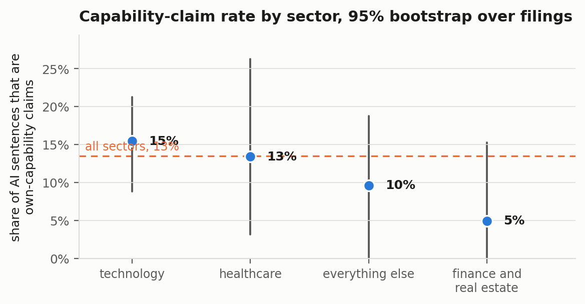

## Abstract

The Securities and Exchange Commission has begun bringing enforcement actions against
companies that overstate what their artificial intelligence can do, a practice the
Commission calls AI washing. Those actions establish that some AI claims in filings are
false. They say nothing about the ordinary case. This paper measures it. Starting from
the complete set of 3,324 annual reports filed in 2025 whose text contains the phrase
artificial intelligence, a stratified sample of 60 filings was drawn, every AI-bearing
sentence was extracted by a splitter fixed before any document was downloaded, and each
of the resulting sentences was classified twice by independent blinded passes against a
preregistered rubric, then calibrated against a blinded review.

Four percent of the extracted sentences turn out not to be about artificial intelligence
at all: the term list matches millilitres in pharmaceutical tables and the letters AI in
company names, and those 25 sentences are enumerated exactly and removed. Of the 598 that
remain, a calibrated 60.5 percent are risk-factor language and 12.2 percent assert a
capability of the registrant's own AI. Of those 75 capability claims, 5 name the quantity
they are claiming, 2 attach a number to it, 1 says what the number was measured over,
none states a baseline and none states an uncertainty. One sentence out of 598, in one
annual report out of 59, clears the minimum bar at which an outside reader could attempt
to verify anything.

The exhaustive part of that result is not an estimate. A numeral is necessary for a
quantified claim, so every sentence in the corpus was screened for one and all 74
candidates were read blind; the two automated passes had found exactly the same two
claims, with identical scores on all five verifiability dimensions, which is a sharp
contrast with the companion audit of an image benchmark where the same calibration design
caught an automated pass that was wrong by nearly a factor of nine. The gap this paper
documents is therefore not a measurement artefact. Companies describe their AI almost
exclusively in language that cannot be checked, and the current enforcement posture, which
requires a claim to be shown false, has very little to work with.

## 1. Introduction

In March 2024 the SEC settled charges against two investment advisers for saying they used
artificial intelligence when they did not, and the Chair of the Commission gave the practice
a name. "Investment advisers should not mislead the public by saying they are using an AI
model when they are not," Gary Gensler said. "Such AI washing hurts investors." In January
2025 the Commission brought the same theory against an operating company, finding that a
restaurant-technology firm had advertised a drive-thru ordering product as eliminating human
order taking when in fact the advanced pilot required a human to enter the order about
seventy percent of the time.

Both cases turn on a claim specific enough to be disproved. The adviser said it used a
model; it did not. The restaurant company said its product eliminated human order taking;
it did not. Enforcement of that kind needs a factual assertion with a truth value, and
what makes these cases unusual is that the companies supplied one.

The question this paper asks is how often that happens. Not how often companies lie, which
is an enforcement question and needs facts outside the filing, but how often they say
anything a reader outside the company could check at all. This matters because a claim
that cannot be checked also cannot be enforced against, cannot be priced accurately, and
cannot be compared across vendors. It occupies a category that is not true and not false
but merely unfalsifiable, and unfalsifiable claims are exactly the ones a competitive
market will select for if nobody is measuring the difference.

The annual report is the right place to look. Form 10-K is signed by the chief executive
and chief financial officer, is subject to the antifraud provisions, and is where the
sell-side, the litigation bar and the Commission all go first. Whatever a company is
willing to commit to in writing about its own AI, it should be willing to write there.
The same numbers appear in the sales deck, but the deck is not signed.

I take a sample of ordinary annual reports, pull out every sentence that mentions AI,
and ask of each one: is this a claim about what the company's own AI does, and if it is,
does the sentence contain enough to let a reader begin checking it? The answer to the
second question is almost always no, and the size of the almost is the contribution.

The design is copied, deliberately, from a companion audit I ran on a computer-vision
benchmark, where a chain of automated passes produced a confident and internally
consistent number that was wrong by nearly a factor of nine, and the only thing that
caught it was a cheap blinded re-check. That experience is why the calibration in this
study is built before the results are looked at, and why one of its components does not
sample at all but enumerates.

## 2. Related work

Textual analysis of 10-K filings is an established field with a well-known warning
attached. Loughran and McDonald (2011) showed that general-purpose sentiment dictionaries
badly misclassify financial language, because words like liability, tax and cost are
negative in ordinary English and neutral in an accounting context, and they built a
finance-specific replacement that is now standard. The lesson generalises past sentiment:
a term list built for one domain and pointed at another will be wrong in ways that are
systematic rather than random, and the only way to find out how wrong is to read some of
what it caught. Section 5.2 reports what happened when I did that to my own term list.

Dyer, Lang and Stice-Lawrence (2017) documented that 10-K disclosure has roughly doubled
in length since the early 2000s and that most of the growth is in boilerplate, concentrated
in risk factors and in newly mandated topics. That finding sets a prior for this study that
was, in the event, correct: the modal AI sentence in an annual report is a risk factor, and
a great many of them are the same risk factor.

On AI specifically, Babina, Fedyk, He and Hodson (2024) measure firm-level AI investment
from employee résumé data rather than from what firms say, and find that AI-investing firms
grow faster and innovate more. Their choice of an external measure over a disclosed one is
itself an argument that disclosure is unreliable. Li (2025) makes the argument directly,
constructing an AI-talk measure from earnings-call transcripts and an AI-walk measure from
résumés, and finding that past talk does not predict subsequent workforce investment once
firm fixed effects are absorbed; the market rewards talk in the short run and penalises it
over a year.

That literature measures the gap between what firms say and what they do. This paper
measures something upstream of it: whether what firms say is the kind of statement a gap
could be measured against. Li's design needs an external ground truth precisely because the
disclosures do not carry one. Nobody, as far as I can find, has gone sentence by sentence
through the annual reports themselves and counted how much of the AI language is a
capability claim and how much of that carries a figure, a metric, an evaluation, a baseline
or an interval.

The criteria I use come from the evaluation literature rather than from accounting. Raji,
Bender, Paullada, Denton and Hanna (2021) argue that benchmark scores are routinely read as
evidence of general capability when the benchmark supports no such reading, and that the
gap is hidden by the absence of a stated construct. Bean et al. (2025) put numbers on the
same problem: with 29 expert reviewers across 445 language-model benchmarks, they find
widespread failures of construct validity in how phenomena are defined, tasks chosen and
scores computed. The five things I check for in a corporate AI claim are the five things
that paper would look for in a benchmark, reduced to the minimum a sentence could plausibly
carry. If a research benchmark with a full methods section often fails to say what it
measured and against what, a single sentence in an annual report was never going to do
better, and the interesting question is by how much.

## 3. Data

### 3.1 The frame

EDGAR full-text search returns every filing whose text matches a phrase. Querying the exact
phrase "artificial intelligence", restricted to Form 10-K and to filings dated in calendar
2025, returns 3,324 filings from 3,173 distinct registrants. I enumerated the frame
completely rather than sampling it, so the stratification below is drawn against known
population counts rather than estimated ones. `src/frame.py` reproduces the enumeration.

The frame is dominated by industries that are not the ones people picture. The largest
single SIC code is 2834, pharmaceutical preparations, with 249 filings, ahead of 7372,
prepackaged software, with 206. Real estate investment trusts and state commercial banks
together contribute another 260. An unstratified draw from this frame would mostly return
biotechnology and banking, which is a true description of who mentions AI in an annual
report but a poor basis for comparing sectors.

### 3.2 The sample

I assigned each filing to one of four strata from the SEC's own SIC code: technology,
healthcare, finance and real estate, and everything else. Fifteen filings were drawn
without replacement from each stratum under seed 20260926, giving 60 filings, one per
registrant so that a company filing several documents cannot dominate. The stratum pools
were 499, 553, 724 and 1,397 filings respectively.

### 3.3 Extraction

Each filing was downloaded from the EDGAR archives, stripped of markup, and split into
sentences by a deterministic splitter with an abbreviation guard. A sentence entered the
corpus if it matched a fixed list of AI terms, was between 60 and 1,200 characters, and
was less than a quarter digits by character. The last two rules are there to keep table
fragments and headings out; they are crude and they do not entirely work, which Section
5.2 quantifies. The term list and the splitter were fixed before any filing was downloaded
and are in `src/fetch_and_extract.py`.

All 60 filings downloaded without error. Fifty-nine of them yielded at least one AI
sentence and one yielded none. The extraction produced 623 sentences, a median of 7 per
filing, a maximum of 65 and a minimum of 1. Every extracted sentence was scored; there is
no second-stage sampling.

## 4. Method

### 4.1 The rubric

The rubric was written into a preregistration before any sentence was read, and is
reproduced in full in `docs/PREREGISTRATION.md`.

Part A assigns exactly one class. A sentence is `capability` if it asserts that the
registrant's own product, service or operation uses AI and attributes a capability,
benefit, efficiency or performance level to it; `risk` if it is risk-factor language about
competition, regulation, security, reputational or ethical exposure arising from AI;
`market` if it describes AI in the industry, in the market or at competitors rather than at
the registrant; `governance` if it describes policy, board oversight, internal controls or
responsible-use programmes; and `other` for definitions, cross-references, boilerplate and
anything that fits none of the above.

Part B applies only when Part A is `capability`, and records five independent yes-or-no
judgements, deliberately binary rather than scaled. Is a specific numeric performance
figure attributed to the AI (`quantified`)? Is the quantity being reported named, for
example accuracy, error rate, hours saved, cost per claim (`metric_named`)? Does the
filing say what data, population or period the figure was measured over
(`evaluation_described`)? Does it say what the figure is being compared against
(`baseline_given`)? Is any interval, sample size or error estimate stated
(`uncertainty_given`)?

Two derived measures were fixed in advance. The `verifiability_score` is the count of the
five that are yes. A claim is `checkable` if it is quantified, names its metric, and
describes its evaluation, which is the minimum at which a reader outside the company could
attempt verification at all. Note how low that bar is. It does not require the claim to be
true, or well measured, or audited. It requires only that the sentence say what was
measured, how much of it there was, and over what.

### 4.2 Blinding and assignment

Raters saw the sentence text and nothing else: no company, no sector, no filing date, no
position in the document. The registrant's name and ticker were removed from the sentence
text where they appeared, which worked for 40 sentences and, as Section 7 reports, left a
measurable residue. Sentences were presented in a seeded shuffle that mixes filings
together, so a rater could not reconstruct a company from a run of consecutive sentences.

Each sentence was assigned to exactly two of six raters by a fixed rule applied before
rating began, giving 1,246 judgements over 623 sentences and 207 or 208 sentences per
rater. Raters could not see each other's output.

### 4.3 The rating passes

The six passes ran independently against the rubric and returned one JSON line per
sentence. All six completed with no reported failures. A schema validator
(`src/validate_ratings.py`) then checked every line: correct rater field, assigned sentence
identifier, no duplicates, no omissions, a legal Part A class, Part B present and boolean
on every capability sentence and null on every other. It passes with zero problems, which
matters mainly because the same validator would have caught a rater that silently dropped
a batch.

### 4.4 Calibration

The preregistration committed to a calibration pass that re-reads a seeded sample of scored
sentences, blind to the verdicts being checked and mixed with controls. I ran that, and
then extended it, and the extension is recorded as an amendment.

**Composition calibration.** A seeded sample of 117 sentences, stratified over the five
agreed classes and the disputed set, was presented as text only in a shuffled order, with
eight of them repeated under a second display identifier as self-consistency controls, for
125 displays in total. I read all 125 and recorded a class for each before reading the key.
This yields, for each class, the rate at which the automated verdict survives review, and
where it goes when it does not.

**Quantification recall audit.** The composition calibration can only bound the bias on
Part B statistically, and Part B is where the headline lives, so I added a component that
does not sample. A numeric performance figure is necessary for `quantified` to be true.
Every sentence in the corpus was therefore screened mechanically for a numeral of a kind
that could express one: a percentage, a multiple, a currency amount, a magnitude word
attached to a digit, or any integer of two or more digits. Seventy-four of the 623
sentences contain such a numeral, which means at most 74 could be quantified, whatever any
pass said. I then read all 74 blind, with the matched numerals shown but no verdicts, and
recorded for each whether the sentence contains a numeric performance figure attributed to
AI. Because the screen is exhaustive over the corpus, the resulting count is exact rather
than estimated, and any claim the automated passes missed would necessarily appear in it.

**Controls.** The eight duplicates sit inside the composition sample. The recall audit acts
as its own control, since it contains many sentences no pass called a capability claim at
all, so the reviewer cannot infer a prior verdict from the fact of selection.

### 4.5 Statistics

Proportions carry Wilson score intervals at 95 percent, chosen over the normal
approximation because most rates here sit close to zero. Sentences within a filing share an
author, a house style and a legal reviewer, so all filing-level uncertainty comes from a
percentile bootstrap that resamples filings rather than sentences, 10,000 replicates under
a fixed seed. Sector comparisons use the bootstrap difference in rates for the same
clustering reason. The calibrated composition is bootstrapped jointly over filings and over
the calibration units within each class, so the noise in the small calibration cells shows
up in the interval instead of being hidden.

The correction itself is a forward transfer, not a matrix inversion. Of the sentences the
passes put in class *i*, a measured fraction belong in class *j*, so the corrected count in
*j* is the sum over *i* of the pass count in *i* times that fraction. Inverting a confusion
matrix estimated from cells as small as five would amplify noise rather than remove bias.

`src/stats.py` runs its own self-checks, including two published worked values for the
Wilson interval and a check that the correction conserves total mass.

### 4.6 Who the raters are

The raters and the calibration reviewer are language models, not people. The six rating
passes ran on Claude Sonnet as independent subagents with no shared context. The
composition calibration, the recall audit and the adjudication were done by the more
capable model orchestrating the study, Claude Opus 5, which is also the author's tool for
the rest of the analysis.

This study therefore does not measure human inter-rater agreement and no figure in it
should be read that way. What it measures is whether independent protocol-driven passes
over the same text reach the same classification, and how far each pass survives review by
a more careful one. Every sentence and every judgement is published, so a reader who
disputes a call can look at the sentence and say so.

## 5. Results

### 5.1 The two passes agree, and where they disagree there is a real boundary

Across the 598 sentences that survive the term correction described next, the two passes
assigned the same Part A class 557 times, an observed agreement of 93.1 percent, with
Krippendorff's alpha for nominal data of 0.879. Agreement is highest on risk, where
positive specific agreement is 0.979, and lowest on market at 0.821.

The 41 disagreements are not scattered. Fifteen of them are capability against other, seven
are market against other and seven are market against risk. Those are the three places
where the rubric has a genuine edge: a sentence that says a company uses AI without saying
what the AI achieves, a sentence that describes an industry trend the company is part of,
and a sentence that describes a regulatory environment without stating a harm. When I
reviewed 20 of the disputed sentences blind, my call landed inside the pair the two passes
had proposed 19 times out of 20. The disputed set is a boundary, not noise, and it is
reported as a bound rather than resolved by a third party who knows the design.

On Part B, restricted to the 75 sentences both passes called capability, the two passes
agreed on `quantified`, `baseline_given` and `uncertainty_given` on every single sentence.
They disagreed seven times on `metric_named` and once on `evaluation_described`.

### 5.2 Four percent of the corpus is not about AI, and it can be counted exactly

The term list was fixed before any filing was downloaded, which is the right order and also
means its failure modes could only be discovered afterwards. Recording which pattern matched
each sentence makes them visible. The pattern `\bml\b`, intended for machine learning as an
abbreviation, also matches mL, the millilitre. Twenty sentences in the corpus match on that
pattern and nothing else, and all twenty are pharmacology or microbiology: minimum
inhibitory concentrations, plasma concentrations, dose-response tables. One of them is an
exhibit index that happens to name a subsidiary called ML California Sub. A second screen
over the sentences whose only match is `ai` finds five more: two instances of a loan
schedule listing a borrower named AI Fire Buyer, Inc., a disposal of stock in a company
called SoundHound AI, a web address ending in .ai, and a stray two-letter token left behind
by text extraction.

That is 25 sentences out of 623, exactly 4.0 percent, containing no reference to artificial
intelligence at all. The number is not an estimate. The screen is mechanical and exhaustive
and the flagged sentences are listed individually in `results/calibration.json`. All 25 are
removed from every denominator that follows, and the independent blinded review of the 74
numeral candidates flagged 19 sentences as non-AI, every one of which falls inside the same
set of 25.

Two things follow. The smaller one is that a study reporting only a headline count of AI
mentions in filings, in this frame, would be overstating it by about four percent, and the
error would fall almost entirely on pharmaceutical registrants, which is a sector the
overstatement makes look more AI-engaged than it is. The larger one is that it took an
audit to find this, the audit cost one script, and the number of published text-analysis
papers that report an equivalent check is small.

### 5.3 What AI language in an annual report is about

Of the 557 sentences the two passes agreed on, 365 are risk-factor language, 75 are
capability claims, 71 are other, 39 are market and 7 are governance. After calibration the
shares over the whole corpus are 60.5 percent risk (bootstrap 51.9 to 69.9), 16.2 percent
other (11.5 to 21.0), 12.2 percent capability (7.7 to 16.6), 9.2 percent market (4.7 to
14.9) and 1.9 percent governance (0.4 to 3.7). Treating the disputed sentences as a bound
instead of calibrating them puts capability between 12.5 and 15.7 percent of the corpus and
risk between 61.0 and 63.7 percent, so the ordering does not depend on the correction.

Five times more of the AI language in an annual report is about what might go wrong than
about what the company's AI does. That ratio deserves a moment. Risk factors are drafted by
counsel to be comprehensive and are widely understood to be defensive boilerplate; Dyer,
Lang and Stice-Lawrence found that this is where 10-K length growth has concentrated for
two decades. The AI paragraph is following the same path. Nineteen of the 59 filings in the
corpus contain at least one claim about their own AI. The other forty mention AI only to
say that it is risky, that the industry is changing, or that they have a policy about it.

### 5.4 The automated verdicts mostly survive review

I was consistent with myself on all eight duplicate controls. On the 97 agreed sentences in
the calibration sample, the passes' verdict survived review 100 percent of the time for
governance (5 of 5), 96.7 percent for risk (29 of 30), 90.0 percent for other (18 of 20),
86.7 percent for capability (26 of 30) and 75.0 percent for market (9 of 12).

The errors have a direction. All four capability sentences I overturned went to other, and
every one of them is a sentence that says a company uses AI without saying what the AI
achieves: a list of services that includes AI, a statement that AI is being built into a
product suite, an announcement of AI agents in development. The passes read incorporation
as capability slightly more readily than I do. Two of the three market overturns also went
to other. The net effect of calibration is therefore to move about two percent of the
corpus out of capability and market and into other, which shrinks the capability
denominator from 75 to 73.2 and makes every verifiability rate very slightly worse.

This is a different kind of calibration result from the companion audit, where the
automated pass was biased hard in one direction and the headline moved by nearly an order
of magnitude. Here the passes are close to right, and I am reporting that with the same
prominence I would have reported the opposite. The design was built to catch a large bias.
It found a small one. That is the outcome a calibration pass is supposed to be able to
return.

### 5.5 Almost nothing is checkable

Of the 75 capability claims, 5 name the quantity being claimed (6.7 percent, Wilson 2.9 to
14.7), 2 attach a number to it (2.7 percent, 0.7 to 9.2), 1 says what the number was
measured over, none states a baseline, and none states an uncertainty. The Wilson upper
bound on a rate of zero in 75 is 4.9 percent, so the honest statement about baselines and
intervals is not that they never happen but that they happen in fewer than one capability
claim in twenty.

Seventy of the 75 capability claims score zero out of five. Three score one, one scores
two, one scores three, and nothing scores four or five.

Exactly one sentence in the corpus is checkable, which is 1.3 percent of capability claims
(Wilson 0.2 to 7.2), 0.17 percent of all AI sentences (0.03 to 0.94), and one annual report
out of 59. It is Kyndryl Holdings describing "executing more than 180 million automated
actions per month in the IT environments we manage." That sentence names a quantity, gives
a figure, and says what population and period it applies to. It is the best AI disclosure
in the sample and it is worth being precise about what it still does not do: 180 million
actions per month is a measure of volume, not of quality. The quality claim in the same
sentence, that this "enables greater quality and efficiency," carries no number at all. The
one checkable claim in 598 sentences quantifies how much the system does, not how well.

The other quantified claim is Rimini Street reporting that its AI applications have been
"accelerating case resolution times by an average of approximately 23%." That names a
metric and gives a number and is not checkable under the preregistered definition, because
the sentence never says which cases, over what period, or against what. Twenty-three percent
faster than what, measured on whom, is a question the filing does not answer and a reader
cannot resolve.

The near misses are instructive in a different way, because they show that vagueness is not
caused by an inability to name metrics. Hologic writes that its 3DQuorum technology
"expedites mammography exam reading time without compromising image quality, sensitivity or
accuracy." That sentence names four distinct metrics, all of them standard, all of them
routinely measured in the clinical literature, and attaches a number to none of them.
Structure Therapeutics writes that its platform evaluates "billions of compounds in silico,
achieving experimental accuracy on properties such as binding affinity and solubility."
Again: the metric is named, the properties are named, the figure is absent. These are
companies that plainly know what the relevant quantity is. The number is not missing
because nobody could think of one.

### 5.6 Technology companies claim more, but not measurably more

Capability claims are 15.5 percent of AI sentences at technology registrants (bootstrap 8.8
to 21.3), 13.4 percent in healthcare (3.1 to 26.3), 9.6 percent in the residual stratum
(0.0 to 18.8) and 5.0 percent in finance and real estate (0.0 to 15.3). The point estimates
put technology on top, as predicted. The bootstrap difference between technology and the
other three strata pooled is +6.2 percentage points with an interval from −3.1 to +14.4,
which crosses zero.

So the preregistered ordering held and the difference is not distinguishable from zero at
this sample size. Fifteen filings per stratum was a choice made to keep the corpus readable
end to end, and it buys enough precision for a rate that is near zero everywhere and not
enough for a between-sector contrast. A study whose primary question was sectoral would
need several times the sample.

### 5.7 The four preregistered predictions

All four held, which I note with some suspicion of myself, since a preregistration that
predicts everything correctly is usually one that predicted the obvious.

Prediction 1, that risk mentions would outnumber capability claims, held by a factor of
five. Prediction 2, that fewer than 10 percent of capability claims would be quantified,
held at 2.7 percent. Prediction 3, that fewer than 2 percent would be checkable, held at
1.3 percent, and the margin there is one sentence: had Kyndryl's disclosure omitted the
phrase "in the IT environments we manage", the corpus would contain no checkable claims at
all and the rate would be zero. Prediction 4, on sectors, held on point estimates only, as
above.

The falsification condition stated in advance was that if most capability claims turned out
to be quantified with a named metric and a described evaluation, the premise of the study
would be wrong and that result would be reported in those words. It did not happen. Two of
75 were quantified.

## 6. What this means

### 6.1 For anyone reading the claim

The practical upshot is a reading rule. When a filing, a deck or a datasheet says that a
company's AI improves, accelerates, optimises or enhances something, the base rate in this
corpus says there is a 97 percent chance there is no number behind it anywhere in the
document, and better than a 98 percent chance that even where there is a number, you cannot
tell what it was measured over. Absence of a figure is not weak evidence of a weak claim.
It is the overwhelming norm, and treating it as a signal about a particular company would
be a mistake in almost every individual case.

That cuts both ways, and the direction people usually miss is the second one. A company
with a genuinely strong, well-measured result is writing into an environment where the
convention is not to state it, so stating it makes the company an outlier and invites the
question of why the competitor's filing is silent. The equilibrium is stable and it is bad
for the firms with the best numbers.

### 6.2 For the enforcement posture

The SEC's AI-washing cases share a structure: the company made a specific claim, and the
Commission proved it false. Delphia said it used client data in a machine-learning model;
it did not. Presto said its product eliminated human order taking; a human entered about
seventy percent of the orders. That theory of liability requires a falsifiable assertion,
and this study measures how rare those are. In 59 annual reports, two sentences attach a
number to a capability claim and one of those says what the number covers.

This is not an argument that enforcement is failing. It is an argument about where the
remaining exposure lives. The 73 unquantified capability claims in this corpus are not
violations, and nothing here suggests any of them is false. But a disclosure regime whose
only lever is falsity has almost no purchase on the modal AI disclosure, because the modal
AI disclosure has no truth value a reader can evaluate. If the Commission wanted that to
change, the instrument would not be more enforcement of the same kind; it would be a
disclosure requirement that a stated capability be accompanied by the metric, the
population and the comparison, in the way that a stated non-GAAP financial measure must be
reconciled to the nearest GAAP one.

### 6.3 What a checkable claim would cost

Nothing about the missing information is expensive. A company that says its AI accelerates
case resolution already knows the metric, because it computed the 23 percent. Adding which
cases, over what period, and against what baseline is one clause. The cost of the clause is
not measurement; it is that the clause creates something a plaintiff or a regulator can
check, and the current equilibrium prices that risk above the benefit of being believed.
That is a solvable coordination problem, and it is solved the same way non-GAAP
reconciliation was solved, which is not voluntarily.

### 6.4 The audit's own weak point, and why this one held

The companion audit of the KFuji RGB-DS image benchmark used this same structure and the
calibration pass caught a serious failure: the automated adjudicators were systematically
biased toward absence, implying that 56 percent of unlabelled objects contained no fruit
when a blinded re-check found that only 17 percent of those calls survived review. The
headline moved by nearly a factor of nine. I built this study expecting something similar,
which is why the recall audit enumerates instead of sampling.

It did not happen. On the measure that drives the headline, the two automated passes found
exactly the claims a blinded exhaustive review found, with identical scores on all five
verifiability dimensions for both, and the composition calibration moved the capability
share by less than two points.

I think the reason is worth stating, because it predicts when this kind of pipeline can be
trusted. The KFuji judgement was perceptual and graded: deciding whether a smudge of green
behind a leaf at 548 by 373 pixels is an apple has no crisp answer, and a model asked for a
binary on a genuinely continuous quantity will lean one way and keep leaning. The
`quantified` judgement is not like that. Either the sentence contains a numeric performance
figure or it does not, and both the model and I can point at the characters. Where the
rubric in this study does get graded, the automated passes are correspondingly less
reliable: `metric_named` is the one Part B dimension with a real answer boundary, and it is
the one where the two passes disagreed seven times out of 75 while agreeing perfectly on
the other four. The rule that falls out is that an automated pass is trustworthy in
proportion to how crisply the question can be settled by pointing at the input, and a
calibration pass is worth its cost exactly when it cannot.

## 7. Limitations

**The sample is small and one year deep.** Sixty filings from calendar 2025, fifteen per
stratum. That is enough for a rate near zero measured over 598 sentences and not enough for
sector contrasts, as Section 5.6 shows. It says nothing about trend.

**The frame is defined by an exact phrase.** A filing that discusses machine learning at
length without ever writing "artificial intelligence" is not in the frame. The choice makes
the frame exactly reproducible and it certainly misses some filings.

**Blinding leaked.** The redaction removed the registrant's full name and ticker, not
individual distinctive tokens, and page headers survive extraction. Screening every corpus
sentence for any name token of four or more characters flags 37 sentences, 6.2 percent;
restricting to tokens that actually identify a filer rather than generic words like Health
or Technology leaves 7 sentences, 1.2 percent, naming two companies. Agreement on the
flagged sentences was 86.5 percent against 93.6 percent on the rest, so leakage did not
help the raters agree; those sentences are page-header fragments and are simply harder.
The residue is small and measured but it is a real deviation from the protocol.

**Sentence-level classification cuts context.** A risk-factor list fragment that has lost
its stem reads differently from the same text inside its paragraph, and several of the
sentences I found hardest to classify were fragments of exactly that kind. A design that
gave raters the surrounding paragraph would classify better and blind worse.

**The raters are models.** No human read these sentences except me, and I am one reviewer
with a stake in the result, which is the reason for the duplicate controls and for
publishing every judgement. A replication with human coders would be a real contribution
and the materials are laid out so that it is cheap: the blinded item files are in
`data/rating/`.

**The rating prompts were not logged.** The six passes were dispatched interactively and
the literal prompt strings were not written to disk. What is published in
`docs/RATER_PROTOCOL.md` is the content of the instruction, the exact inputs each pass was
shown and the exact output each returned, but not a byte-exact transcript of the wording.
A replication should treat the preregistered rubric and the output schema as the
specification. This is a real gap and the fix is trivial for the next study, which is to
write the prompt to the repository before dispatching anything.

**`metric_named` is the soft number.** The quantified and checkable counts are exhaustive
and exact. The metric-named count of 5 is the both-passes-agreed count on a dimension where
the passes disagreed seven times, and the reviewer's own reading of the numeral candidates
does not cover sentences that name a metric without any numeral. Treat 5 as a floor with a
loose ceiling; the two counts that carry the argument do not depend on it.

## 8. Conclusion

Across 59 ordinary annual reports, 598 sentences mention artificial intelligence. Sixty
percent of them are about risk. Seventy-five assert that the company's own AI does
something useful. Two of those attach a number. One says what the number was measured over.
None states a baseline and none states an uncertainty.

The result is not that companies are lying, and nothing in this paper identifies a false
statement. The result is that the overwhelming majority of corporate AI capability claims
are constructed so that the question of truth does not arise. They are not false; they are
not checkable. That is a different problem from AI washing, it is far more common than AI
washing, and the enforcement tools currently aimed at the first do almost nothing about the
second.

The measurement itself came out cleaner than I expected. Two independent automated passes
over the same text agreed 93 percent of the time, and on the one judgement that determines
the headline they found precisely what an exhaustive blinded review found. Four percent of
the corpus turned out not to be about AI at all, which an audit caught and a headline count
would not have. Both of those are arguments for the same practice: enumerate where you can
instead of sampling, and check the pipeline against a more careful pass before you believe
its output, including when the output is the one you were hoping for.

## Data and code

Everything is in the repository at `https://github.com/ishaanshah101/ai-claims-audit`.

`src/frame.py` enumerates the EDGAR frame, `src/sample_filings.py` draws the stratified
sample, `src/fetch_and_extract.py` downloads and extracts, `src/build_rating_sets.py`
blinds and assigns, `src/validate_ratings.py` checks the rater output against the schema,
`src/agreement.py` computes inter-pass agreement, `src/build_calibration.py` builds the
blinded calibration materials, `src/term_audit.py` runs the term-list screen,
`src/calibrate.py` unblinds and measures the bias, `src/analyze.py` produces every number
in this paper, `src/figures.py` draws the figures, and `src/verify_paper.py` recomputes
every figure quoted here from the raw data and exits non-zero on any mismatch.

The corpus, the blinded item files, all 1,246 rater judgements, the blinded calibration
materials with their keys, and the reviewer's own judgements are in `data/`. The
preregistration and its amendments are in `docs/PREREGISTRATION.md`.

## References

Babina, T., Fedyk, A., He, A. X., and Hodson, J. (2024). Artificial intelligence, firm
growth, and product innovation. *Journal of Financial Economics*, 151, 103745.

Bean, A. M., et al. (2025). Measuring what matters: construct validity in large language
model benchmarks. *Advances in Neural Information Processing Systems 38*.
arXiv:2511.04703.

Dyer, T., Lang, M. H., and Stice-Lawrence, L. (2017). The evolution of 10-K textual
disclosure: evidence from Latent Dirichlet Allocation. *Journal of Accounting and
Economics*, 64(2), 221–245.

Li, B. (2025). AI washing. Working paper, University of Florida, August 2025.

Loughran, T., and McDonald, B. (2011). When is a liability not a liability? Textual
analysis, dictionaries, and 10-Ks. *The Journal of Finance*, 66(1), 35–65.

Raji, I. D., Bender, E. M., Paullada, A., Denton, E., and Hanna, A. (2021). AI and the
everything in the whole wide world benchmark. arXiv:2111.15366.

Shah, I. (2026). How finely can a fruit detection benchmark be read? An annotation audit
of KFuji RGB-DS. `https://github.com/ishaanshah101/kfuji-annotation-audit`.

U.S. Securities and Exchange Commission (2024). SEC charges two investment advisers with
making false and misleading statements about their use of artificial intelligence. Press
release 2024-36, 18 March 2024.

U.S. Securities and Exchange Commission (2025). In the matter of Presto Automation Inc.
Order instituting cease-and-desist proceedings, Securities Act Release No. 33-11352,
14 January 2025.
